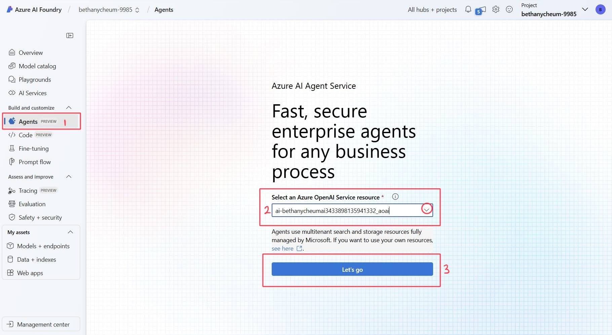

# パート4 - Azure AI エージェント

このワークショップのパート4へようこそ！

これまで、さまざまな方法で大規模言語モデルと対話してきました。しかし、これらの対話は個別であり、非常に特定の目的に限定されていました。**Azure AI エージェント**は、これまでの対話を統合して1つのソリューションにまとめることで、次のステップへ進む手助けをしてくれます。

> [!TIP] 
> **Azure AI エージェントとは？**  
> Azure AI エージェントは、開発者が安全に高品質で拡張可能なAIエージェントを構築、デプロイ、スケールできるように設計されたフルマネージドサービスです。基盤となるコンピューティングリソースやストレージリソースを管理する必要がなく、状態管理、コンテキストの関連付け、チャットスレッド、コード実行などの機能を統合しています。また、サードパーティの拡張機能にアクセスしやすくなっています。

以前は、カスタムAIエージェントを構築するには、経験豊富な開発者であっても多くの作業が必要でした。チャット補完APIは軽量で強力ですが、基本的にステートレスであるため、開発者は会話の状態やチャットスレッド、ツールの統合、ドキュメントやインデックスの取得、コードの手動実行などを管理する必要がありました。

Azure AI Foundryでは、AIエージェントは「スマート」なマイクロサービスとして機能し、質問に答えたり（RAG）、アクションを実行したり、ワークフローを完全に自動化したりできます。生成AIモデルの力と、実世界のデータソースにアクセスして対話するツールを組み合わせることで、これを実現します。

エージェントは必要に応じて複数のツールに同時アクセスすることも可能です。これらのツールには以下が含まれます：
- **Function Calling**
- **Code Interpreter**
- **File Search**
- **Bing 検索によるグラウンディング**
- **Azure Functions** など

このセクションでは、Code Interpreterについて取り上げます。

## エージェントの構成要素を理解する

Azure AI エージェントを使い始めるには、機能に関与するさまざまな構成要素を理解し、それに対応することが重要です。

すでに学んだように、**エージェント**とは、RAGを活用して質問に答えたり、ワークフローを自動化したり、アクションを実行したりできる「スマート」なマイクロサービスにすぎません。

エージェントが作成されたら、次のステップは**スレッド**を作成することです。**スレッド**とは、エージェントとユーザー間の会話セッションのことを指します。スレッドはメッセージを保存し、モデルのコンテキストに収まるように内容を自動的に切り詰めます。

**メッセージ**はエージェントまたはユーザーによって作成され、テキスト、画像、その他のファイルが含まれます。これらはスレッド内のリストとして保存されます。

最後に、エージェントを**実行**することができます。これは、スレッドの内容に基づいてエージェントをアクティブ化し、動作を開始させることを意味します。エージェントはその構成と*スレッドのメッセージ*を使用して、モデルやツールを呼び出してタスクを実行します。実行の一環として、エージェントは*スレッドにメッセージを追加*します。

## エージェントの作成

1. 左側のナビゲーションバーで _Build and customize_ を選択し、**Agents** を選択します。開いたページで、Azure OpenAI Service リソースを選択するための下向き矢印をクリックし、**Let's go** ボタンを選択します。



2. 新しいエージェントがすでに作成されています。**Deployments** セクションで、**gpt-4o-mini** モデルを選択していることを確認してください。

    >[!TIP] 
    > **正しいデプロイメントを選択したことを確認してください**。**gpt-4o-mini** とそのバージョンが表示されている必要があります。

3. 次に、エージェントに名前を付けます。エージェント名のテキストボックスに以下を入力してください：

    ```Contoso Outdoor Sales Agent```

4. 次に、エージェントに**指示**を与えます。以前のセクションで見た*システムメッセージ*と同様に、エージェントに従うべき目標を提供します。**Prompt** タブに移動し、以下の指示をInstructionsテキストボックスにコピーしてください。

    ``` 
    You are a sales Agent for Contoso Outdoor. You are polite, professional, helpful and friendly.

    You get all the sales data from the uploaded .csv files. There is sales revenue data that is broken down by region, product category, product type and separated by year and month.

    Examples of regions include Africa, Asia, Europe and America. Categories include climbing gear, camping equipment, apparel and others. Product categories include jackets, hammocks, wet suits, shoes and more. 

    If a question is not related to sales or you cannot answer the question, you **must** respond: "Please contact IT for more assistance". If the user asks for help or says 'help', provide a list of sample questions that you can answer.
    ```

    

    >[!NOTE]
    >このプロンプトには、以前のセクションで学んだプロンプトエンジニアリング技術がいくつ含まれているかを確認してみてください。ヒントについては、ワークショップのパート2を参照してください。

5. **Actions** タブに移動し、**add** をクリックします。

    

6. 新しいタブが開きますので、**Code interpreter** を選択します。

7. 次のウィンドウで、**select local files** をクリックし、`Contoso_Sales_Revenue.csv` file on your Desktop.
    

    >[!NOTE]
    > If you cannot find the file on your desktop, you can download it from [here](../../../../lab/Skillable Workshop Instructions/assets/Contoso_Sales_Revenue.csv).

7. Click on the **upload and add** button. You should now see the file under the *Code Interpreter* tool.

The Agent is now ready for us to interact with it.

## Interacting with our Agent

1. On the top right of our Agents window, select **Try in playground**


2.  Let's begin by typing `help` を選択します。これにより、新しいスレッドが開始されます。  
チャットボックスに一連のサンプル質問が表示されるのがわかります。これらの質問の1つを試して、エージェントの応答を確認してください！

8. 次に、特定のクエリを試してみましょう。以下を入力してください：

    ```What are the total sales for Europe broken down by category? ```

    エージェントがCode Interpreterを使用して回答を提供するのがわかります。

9. 次に、このデータを操作してみましょう。以下のプロンプトを入力してください：

    ```Put this data in a graph. ```

    Code Interpreterを通じて、エージェントは構造化データをグラフに変換することができます！

10. 別のタイプのグラフを見たい場合は、以下のプロンプトを試し、データをグラフにするようリクエストしてください：

    ```What is the trending product category? Give the output as a graph. ```

    エージェントは、売上収益データを時間経過で分析し、トレンド商品を示すグラフを提供するはずです。

おめでとうございます！これでワークショップの最後のパートが終了し、Azure OpenAI エージェントが何であるか、どのように動作するか、そしてAzure AI Foundryポータルを使用してそれを作成する方法を学びました。

**Next** をクリックして、ワークショップのまとめセクションに進んでください。

**免責事項**:  
この文書は、機械ベースのAI翻訳サービスを使用して翻訳されています。正確さを追求しておりますが、自動翻訳にはエラーや不正確な部分が含まれる可能性があります。元の言語で記載された文書が公式な情報源と見なされるべきです。重要な情報については、専門の人間による翻訳を推奨します。本翻訳の使用に起因する誤解や誤認について、当方は一切の責任を負いません。