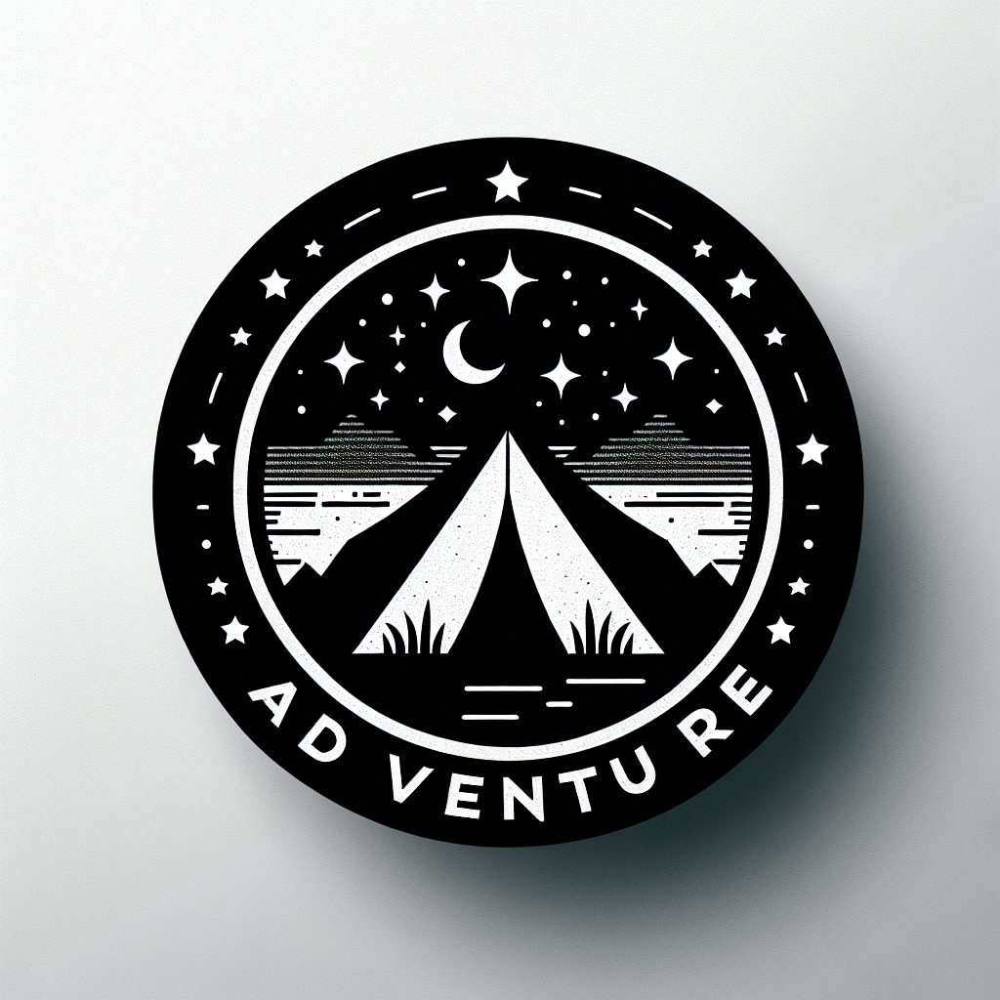

# パート2: 画像生成

このワークショップのパート2へようこそ！ここでは、テキストから画像を生成するモデル「DALL-E 3」を使用します。

> [!TIP]  
> **DALL-E 3とは？**  
> DALL-E 3は、**自然言語入力**をもとにグラフィックデータを生成できるニューラルネットワークベースのモデルです。簡単に言えば、DALL-E 3に**説明文**を提供すると、それに基づいた適切な画像を生成してくれます。

## 最初の画像を作成する

最初の画像を作成するには、以下の手順に従ってください：


1. 左側のナビゲーションバーから **playgrounds** に移動し、**Try the Image Playground** を選択します。
2. Images playgroundで、**Deployments** とラベル付けされたドロップダウンメニューを見つけてクリックします。リストから **dall-e-3** を選択します。
3. Images playgroundで、_"Describe the image you want to create."_ とラベル付けされたテキストボックスを見つけます。以下のプロンプト例から「T」をクリックすると（例：``here is a sample prompt``）、現在のカーソル位置に自動入力されます。
4. メッセージを入力したら、**Generate** ボタンが表示されます。このボタンをクリックして、画像の説明をモデルに送信します。
5. クエリを送信した後、モデルが処理して応答するまで少し待ちます。応答は入力欄の下のウィンドウに表示されます。

では、説明ボックスに基本的なプロンプトを入力し、生成ボタンをクリックして画像を生成してみましょう：

```a watercolor painting of Chicago skyline```

これにより、以下のような画像が生成されます：


DALL-E 3が生成する画像はオリジナルであり、キュレーションされた画像カタログから取得されたものではありません。つまり、DALL-E 3は適切な画像を検索するシステムではなく、トレーニングデータに基づいて新しい画像を生成する人工知能（AI）モデルです。

### 具体的に記述する

詳細を記述することで、より正確な応答を得ることができます。テキスト生成と同様に、画像生成モデルも詳細な説明を提供することで、生成結果の精度が向上します。

1. 例えば、以下のプロンプトを入力します：

    ```A logo for an adventure brand```

2. 次に、**Generate** を選択して生成された画像を確認します。

    

3. 次に、説明文にさらに詳細を加えてプロンプトを修正してみましょう：

    ```A logo combining a tent silhouette and stars, with a rustic feel for an adventure brand.```

4. 再度 **Generate** を選択して結果を比較します。

    

### ベストプラクティス

DALL-E 3で効果的かつ正確な画像を作成するためのベストプラクティスを以下に示します：

1. **明確で詳細なプロンプト**：テキストプロンプトを明確かつ詳細に作成しましょう。説明が具体的であればあるほど、DALL-E 3はリクエストに一致する画像を生成しやすくなります。主題、アクション、環境、スタイル、重要な詳細などを含めてください。

2. **形容詞の使用**：形容詞や副詞を使用して、画像に持たせたい性質、感情、特徴を記述します。これにより、生成される画像がビジョンにより近づきます。

3. **詳細と簡潔さのバランス**：詳細は重要ですが、過度に複雑または矛盾したプロンプトはAIを混乱させ、予期しない結果を招く可能性があります。説明に十分な文脈を提供しつつ、過度に込み入らないバランスを目指しましょう。

4. **異なるスタイルを試す**：特定の美的感覚を持たせたい場合、芸術的なスタイルや影響を指定しましょう。たとえば、アート的な画像をリクエストすることができます。

5. **反復的アプローチ**：最初に生成された画像が完璧でない場合があります。それを出発点として、出力に基づいてプロンプトを繰り返し調整し、理想の結果に近づけましょう。

6. **アスペクト比と構図**：画像の構図やアスペクト比に関する希望がある場合、それをプロンプトに含めましょう。たとえば、横長の画像や、被写体が中央から外れたポートレートをリクエストすることができます。

7. **文化的および文脈的な参照**：適切であれば、文化的または歴史的な参照を含め、画像生成プロセスを導くための追加の文脈を提供しましょう。

8. **責任あるAIの考慮**：プロンプトの内容に責任を持ちましょう。攻撃的な画像、ステレオタイプを助長する画像、または著作権を侵害する画像の作成は避けてください。

9. **テストと学習**：さまざまなプロンプトを試して、DALL-E 3が異なる説明をどのように解釈するかを理解しましょう。この学習プロセスにより、プロンプトの精度を時間とともに向上させることができます。

10. **ガイドラインの遵守**：プロンプトを作成する際には、OpenAIの使用ポリシーとコンテンツガイドラインを遵守してください。OpenAIのコンテンツポリシーにより許可されていない画像をリクエストすることは避けましょう。

## ブランドマスコットの作成

このワークショップでは、DALL-E 3の機能を活用して、フレンドリーな動物、ロボット、抽象的な人物など、さまざまなテーマのブランドマスコット画像を生成します。

また、DALL-E 3のさまざまなパラメーターをテストし、生成される画像の多様性を探ります。これらのパラメーターには次のものが含まれます：

- **画像サイズ**：正方形、横長、縦長など、異なるサイズを試して、画像の寸法がデザインやキャンペーンでの使いやすさにどのように影響するかを理解します。
- **画像スタイル**：ナチュラルやビビッドなど、異なるスタイルを試して、ブランドの個性に最も合うものを見つけます。
- **画像品質**：印刷に適した高解像度画像と、ウェブやソーシャルメディアでの使用に適した低解像度バージョンを生成するために品質設定を調整します。サイズはHDまたは標準のいずれかです。

1. ブランドマスコットを生成することから始めましょう。以下のようなプロンプトを検討してください：

```A friendly robot mascot with a smiling face, designed in a cartoon style.```


```A playful fox mascot with a colorful scarf, representing agility and creativity.```

```An abstract figure with geometric shapes, conveying innovation and technology.```

2. Playgroundで、_省略記号アイコン_ をクリックし、Settingsに移動します。
3. 各セクションで _ドロップダウン矢印_ をクリックしてパラメーターを変更します。
4. 更新された設定で再度プロンプトを試してみてください。

## 高度なプロンプト作成

基本的なプロンプトをいくつか試したところで、新しい方法を試してみましょう。

>[!alert]  
> **システムメッセージを空にすることを確認してください。** 必要に応じて、**Reset to Default** をクリックしてシステムメッセージをデフォルトに戻すことができます。

ここでは、gpt-4o-miniによって生成されたプロンプトを基に画像を生成します。

1. **Chat Playground** に戻ります。

2. **System message** の横にある **Give the model instructions and context** に既存のメッセージがある場合、それを削除してシステムメッセージをデフォルトにリセットします。

3. **チャットボックス** に、作成したい製品の詳細な説明を入力し、リクエストをモデルに送信します。

```
Generate a prompt for DALL-E 3 from this product description:

The 3D Animated Office Space Design by CreativeSpaces offers a modern, interactive representation of a professional work environment. This design concept includes ergonomic furniture, open and collaborative workspaces, greenery for a touch of nature, and large windows to maximize natural light. The layout also incorporates meeting pods, hot desks, and breakout areas for different work modes. The office has a neutral color palette, with accents of green and blue to create a calming yet productive atmosphere.

The 3D Animated Office Space Design is intended for use by architects, interior designers, and companies looking to revamp their workspaces. It highlights the importance of balancing privacy with collaboration, including quiet zones for focused work and shared areas for team interactions. The space features modern materials like glass and wood, combined with innovative lighting solutions to enhance productivity and employee well-being.

Beyond its aesthetic appeal, the 3D Animated Office Space Design is designed with functionality in mind. It includes ample storage solutions, acoustic panels to reduce noise, and modular furniture that can be rearranged to suit different needs. The green walls and potted plants throughout the office create a refreshing environment that promotes creativity and reduces stress. The design is presented in a high-quality 3D animation, providing a realistic walkthrough that allows clients to visualize the space effectively.
```

4. 応答を取得したら、応答の上部にある三点リーダーをクリックし、**Copy response to clipboard** を選択します。


5. **Images Playground** に戻り、生成されたプロンプトを **Prompt Box** に貼り付けます。

6. **Generate** をクリックし、詳細な画像がどのように生成されるかを確認します。


## 次のステップ

おめでとうございます！これでラボの第2部を完了し、Contoso Outdoors Companyのeコマースウェブサイトに必要な画像アセットを生成しました。次のパートでは、マルチモーダルリクエストにモデルを使用する方法を学びます。

[パート3: マルチモーダリティ](./04_Multimodal_Interfaces.md) に進みましょう。

**免責事項**:  
この文書は、機械ベースのAI翻訳サービスを使用して翻訳されています。正確さを期すよう努めておりますが、自動翻訳には誤りや不正確さが含まれる場合があります。元の言語で記載された原文が正式な情報源とみなされるべきです。重要な情報については、専門の人間による翻訳をお勧めします。この翻訳の使用により生じた誤解や解釈の誤りについて、当社は一切の責任を負いません。