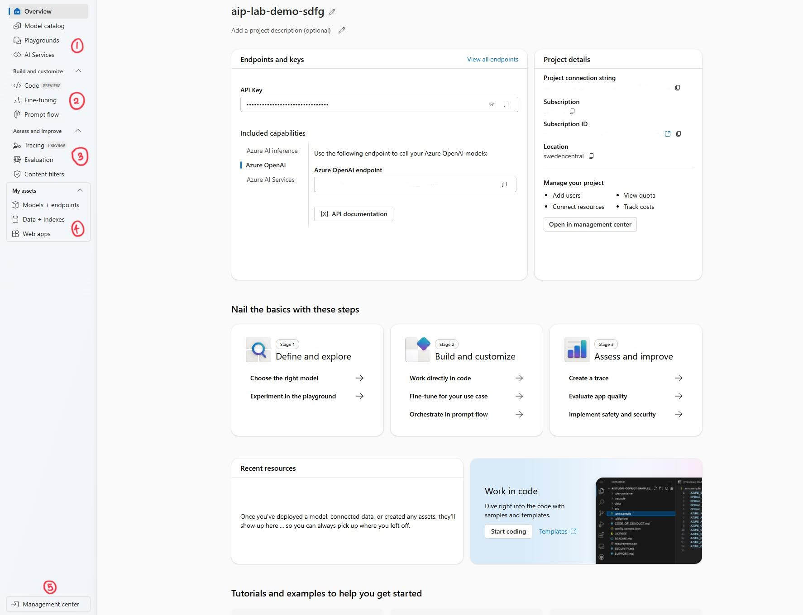
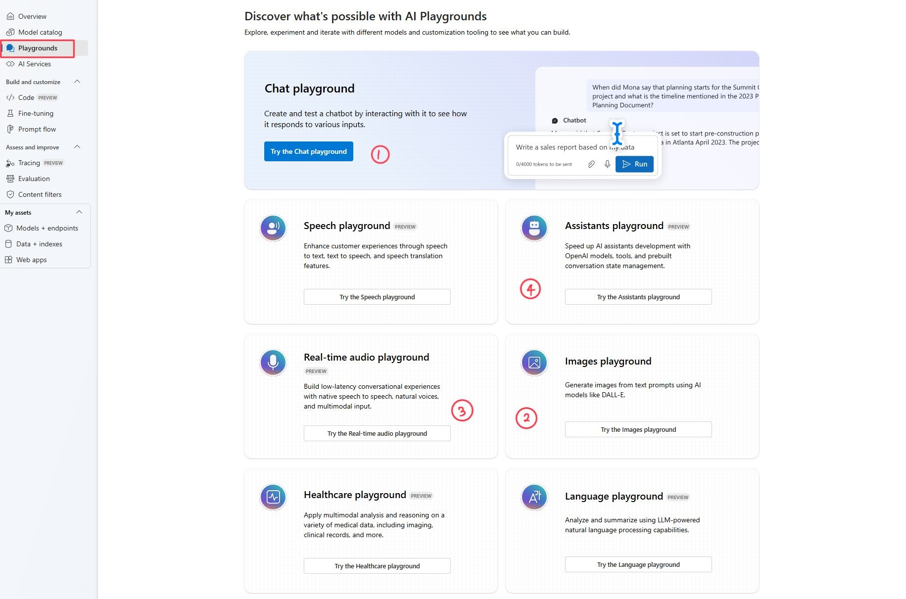
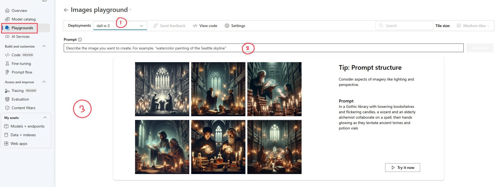
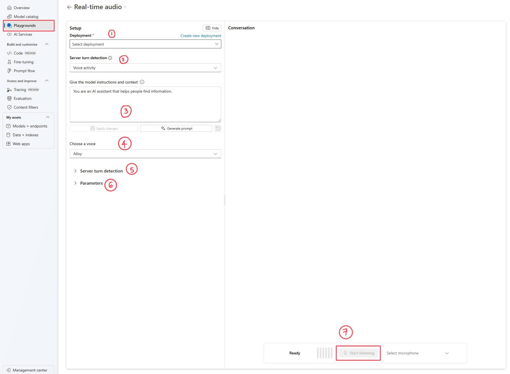

# 快速入門

> [!TIP]  
> **Azure AI Foundry 是什麼？**  
> Azure AI Foundry 是創新者打造未來的終極平台。它提供了一套完整的 Azure AI 功能和工具，讓您能夠設計、客製化和管理 AI 應用程式與代理。該平台無縫整合了全球最受歡迎的開發者工具，包括 GitHub、Visual Studio 和 Copilot Studio。Azure AI Foundry 賦能開發者和 IT 管理員，讓他們能夠輕鬆高效地實現 AI 的願景。

## 先決條件

完成本實驗室需要以下條件：

- 一個 Azure 訂閱 - [免費創建一個](https://azure.microsoft.com/free/cognitive-services?WT.mc_id=aiml-132569-bethanycheum)
- 一個 Azure OpenAI 資源，並且在支援的區域中有 [GPT-4o 和 DALL.E 3 模型](https://learn.microsoft.com/en-us/azure/ai-services/openai/concepts/models#assistants-preview?WT.mc_id=aiml-132569-bethanycheum)

## 部署您的資源

在本次工作坊中，我們將使用 Azure AI Foundry。首先，請按照以下步驟部署必要的資源：

1. 點擊以下按鈕以部署您的資源：

2. 在新開啟的頁籤中，登入您的 Azure 帳戶。

3. 登入後，您將被重定向到基於自定義模板創建資源的頁面。創建一個新的資源群組，並將其命名為 **interact-with-llms**。

4. 接著，在 **Unique Suffix** 欄位中，輸入任意四個獨特字母。完成後，點擊 **Review and Create** 按鈕以創建資源。

> [!NOTE]  
> 資源部署大約需要 2-3 分鐘完成。

5. 在本次工作坊中，我們將專注於 Azure AI Foundry 的「Playground」功能。資源部署完成後，請在瀏覽器中前往 Azure AI Foundry：[https://ai.azure.com](https://ai.azure.com?WT.mc_id=aiml-132569-bethanycheum)

## 瀏覽 Azure AI Foundry

1. 首先，導航到左側邊欄中的 **Management** 區域。在此區域中選擇 **All Resources**。此操作將引導您進入一個集中式區域，顯示所有可用的資源和工具，讓您能夠概覽目前的中心連接。

> [!NOTE]  
> 如果找不到 **All Resources** 區域，請點擊 **All Hubs** 區域。

2. 在可用中心的列表中找到 **Workshop AI Hub**。**點擊該專案**以進入其設置和資源。

## 專案

### 專案概覽

在這個頁面上，我們可以看到 Azure AI Foundry 專案的概覽，包括：
- **專案名稱與描述**：專案的名稱以及 Azure AI Foundry 專案的簡短描述。
- **專案詳細資訊**：包含專案的連接字串、位置、資源群組等各種屬性。
- **端點與金鑰**：Azure AI Foundry 支援連接多個資源，進一步擴展其功能。例如 Azure OpenAI、Azure AI Search 和 Azure AI Services，讓我們能夠使用 LLM 部署或進行向量搜索等功能。在此處，我們可以找到有用的資訊，如 *API 端點與金鑰* 和文件。
- **最近的資源與教程**：此處將突出顯示您最近使用的資源，並提供額外的學習資源和教程，幫助您快速入門。

### 導航欄

您會注意到導航欄已更新，新增了與專案相關的功能標籤。

我們有以下新區域：
1. 第一部分包括 _Playgrounds_（與模型互動）、_Overview_（專案概覽）、_Model Catalog_（展示 Azure AI Foundry 中的可用模型）以及 _AI Services_（列出可用的 Azure AI Services，並提供示範、使用案例等）。
2. **Build and Customize**：提供擴展專案範圍的選項，例如運行雲端計算的 _Code_、[_Prompt Flow_](https://learn.microsoft.com/en-us/azure/ai-studio/how-to/prompt-flow)、以及對部署進行 _Fine Tuning_。
3. **Assess and Improve**：包括為模型開發 _Evaluations_、_Tracing_（調試流程）以及 _Content Filters_（為輸入提示和輸出結果添加防護措施）。
4. **My assets**：在此處，您可以為專案添加額外元素，例如 _Data_、_Indexes_、_Models and Endpoints_ 和 _Web apps_。
5. **Management Center**：用於管理所有中心和專案的詳細資訊及資源的集中位置。

在本實驗中，我們將專注於使用 **Playgrounds**，請導航至 Playgrounds，然後進入下一部分。

## Playgrounds

您會發現 **Playground** 提供了不同的選項。每個選項代表與 AI 模型互動和使用的不同方式，可根據您的特定需求進行調整。

我們的大部分操作將在這些 Playgrounds 中完成，主要是以下幾個：

1. **Chat Playground**  
2. **Images Playground**  
3. **Real-time audio playground**  
4. **Agents playground**  

### Chat Playground

在 Playground 區域內，導航到 **Chat playground**，然後選擇 **Try the Chat Playground**。此功能允許您以對話格式與各種 AI 模型進行互動和測試。

1. **Deployment**：此區域允許我們切換部署的模型。
2. **System Message Box**：在此處輸入模型的指令，這些指令會在用戶互動前執行。
3. **Add your data**：Azure AI Foundry 支援為部署的模型提供外部數據，提升搜索與上下文能力。
4. **Parameters**：此標籤包含模型的詳細設置，例如溫度值。
5. **Chat Box**：此處將顯示我們與模型的互動內容。
6. **Prompt Box**：這是我們輸入要發送給模型提示的地方。

### Images Playground

返回 Playgrounds，選擇 **Image playground**，然後點擊 **Try the Image Playground**。此選項允許您進行圖像生成。

1. **Deployments**：在此下拉選單中，我們可以選擇用於圖像生成的模型。這些模型與聊天模式中的模型一樣，來自我們的部署。
2. **Prompt Box**：與聊天 Playground 的提示框類似，用戶在此輸入描述圖像生成需求的內容。
3. **Results Box**：生成的圖像將顯示在此處。

### Real-time audio playground

返回 Playgrounds，然後選擇 **Real-time audio playground**，點擊 **Try the Real-time audio Playground**。此功能允許您以音頻對話的形式與各種 AI 模型進行互動和測試。

1. **Deployment**：此區域允許我們切換部署的模型。
2. **Server turn detection**：決定伺服器是否應使用語音活動檢測 (VAD) 來識別用戶已完成講話。
3. **System Message Box**：在此處輸入模型的指令，這些指令會在用戶互動前執行。
4. **Choose a voice**：gpt-4o-realtime 提供多種聲音選項，具備不同口音或語調能力。
5. **Server turn detection**：額外參數可通過改進語音活動檢測來優化模型效率和性能。
6. **Parameters**：此標籤包含模型的詳細設置，例如溫度值和最大響應。
7. **Prompt Button**：與聊天 Playground 的提示框類似，這是用戶向模型輸入內容的地方。

## Agents playground

在導航欄中選擇 **Agents**。此功能為您提供建構、測試和客製化 AI 驅動代理的工具。

當您 _Create your first Agent_ 後，界面組件如下：
1. **Agent id and name**：在此為您的 Agent 命名。
2. **Deployment**：在此下拉選單中，我們可以選擇用於圖像生成的模型。這些模型與聊天模式中的模型一樣，來自我們的部署。
3. **Instructions Box**：在此處輸入模型的指令，這些指令會在用戶互動前執行。

4. **Knowledge**：知識使代理能夠訪問數據源，以提供更具依據的回應。
5. **Actions**：通過允許代理在運行時執行各種工具來增強其功能。
6. **Model settings**：此標籤包含模型的詳細設置，例如溫度值和 Top P。
7. **Prompt Box**：與聊天 Playground 的提示框類似，這是用戶向模型輸入內容的地方。

## 準備開始

以上介紹了 Azure AI Foundry 的必要設置和基本功能。接下來，我們將開始與模型進行互動。

返回 **Chat** 下的 **Project Playground**，然後在指示中點擊 Next，繼續進入第 1 部分：文字生成。

> [!IMPORTANT]  
> 返回 **Chat Playground**，並移至 [第 1 部分：文字生成](./02_Text_Generation.md)

**免責聲明**：  
本文件使用基於機器的人工智能翻譯服務進行翻譯。儘管我們努力確保準確性，但請注意，自動翻譯可能包含錯誤或不準確之處。應以原語言的原始文件作為權威來源。對於關鍵信息，建議尋求專業人工翻譯。我們對因使用本翻譯而引起的任何誤解或錯誤解釋不承擔責任。