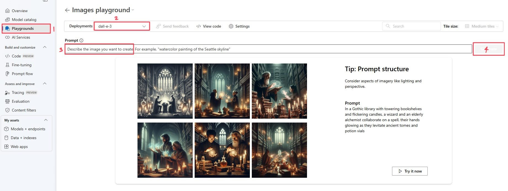

# 第二部分：圖片生成

歡迎來到這次工作坊的第二部分，我們將與文本生成圖片模型 DALL-E 3 進行互動。

> [!TIP]
> 什麼是 DALL-E 3？DALL-E 3 是一種基於神經網路的模型，可以從**自然語言輸入**生成圖像。簡單來說，你可以提供 DALL-E 3 一個**描述**，它就能生成相應的圖片。

## 創建你的第一張圖片

要創建你的第一張圖片，請按照以下步驟操作：



1. 在左側導航欄中，前往 **playgrounds**，然後選擇 **Try the Image Playground**。
2. 在 Images playground 中，找到並點擊標有 **Deployments** 的下拉選單。在下拉列表中選擇 **dall-e-3**。
3. 在 Images playground 中，找到標有 _"Describe the image you want to create."_ 的文本框。從下面的提示示例中點擊 "T"（例如 ``here is a sample prompt``），這將自動將內容輸入到當前光標位置。
4. 輸入描述後，將出現一個 **Generate** 按鈕。點擊該按鈕提交你的圖片描述給模型部署。
5. 發送查詢後，稍等片刻，模型將處理並回應。回應將顯示在輸入框下方的窗口中。

讓我們從在描述框中輸入一個簡單的提示開始生成圖片，然後點擊生成：

```a watercolor painting of Chicago skyline```

這將生成如下的圖片：


DALL-E 3 生成的圖片是原創的；它們不是從策劃的圖片庫中檢索的。換句話說，DALL-E 3 不是用來搜索合適圖片的系統，而是一個基於其訓練數據生成新圖片的人工智慧（AI）模型。

### 提供具體描述

詳細的描述可以帶來更準確的結果。與文本生成類似，圖片生成模型非常依賴於你對目標圖像的詳細描述。

1. 例如，輸入以下提示：

    ```A logo for an adventure brand```

2. 然後選擇 **Generate**，查看生成的圖片。

    

3. 現在，讓我們通過添加更多細節來修改提示：

    ```A logo combining a tent silhouette and stars, with a rustic feel for an adventure brand.```

4. 再次選擇 **Generate** 並比較結果。

    

### 最佳實踐

為了使用 DALL-E 3 創建出有效且準確的圖片，以下是一些最佳實踐：

1. **清晰且具描述性的提示**：撰寫清晰且詳細的文字提示。描述越具體，DALL-E 3 就越有可能生成符合你需求的圖片。包括主題、動作、環境、風格和任何重要細節。
2. **使用形容詞**：用形容詞和副詞來描述你希望圖片傳達的特質、情感和特徵。這有助於更精確地匹配你的期望。
3. **細節與簡潔的平衡**：雖然細節很重要，但過於複雜或矛盾的提示可能會讓 AI 感到困惑，導致意外結果。保持描述足夠清晰，同時避免過於冗長。
4. **嘗試不同風格**：如果你希望圖片具有特定的藝術風格或影響，可以在提示中明確說明。例如，你可以要求生成一張藝術感強的圖片。
5. **迭代方法**：通常，第一次生成的圖片可能並不完美。將其作為起點，根據輸出反覆調整提示，逐步接近理想結果。
6. **比例和構圖**：如果你對圖片的構圖或比例有偏好，可以在提示中說明。例如，你可以要求生成橫向圖片或主體偏向一側的構圖。
7. **文化和背景參考**：如果合適，可以加入文化或歷史參考，為圖片生成過程提供更多背景資訊。
8. **負責任的 AI 使用**：注意你的提示是否符合負責任的 AI 應用要求。避免生成具有冒犯性、加深刻板印象或侵犯版權的圖片。
9. **測試與學習**：嘗試不同的提示，了解 DALL-E 3 如何解讀各種描述。這個學習過程將幫助你逐步提高提示的準確性。
10. **遵守指南**：在創建提示時，遵守 OpenAI 的使用政策和內容指南。避免請求生成不符合 OpenAI 內容政策的圖片。

## 品牌吉祥物創建

在這次工作坊中，我們將利用 DALL-E 3 的能力為品牌創建吉祥物，聚焦於不同的主題，例如友善的動物、機器人或抽象形象。

我們還將測試不同的 DALL-E 3 參數，以探索生成圖片的多樣性。這些參數包括：

- **圖片大小**：嘗試不同的大小（例如正方形、橫向、縱向），以了解圖像尺寸如何影響設計和吉祥物在不同活動中的可用性。
- **圖片風格**：嘗試不同風格，例如自然或鮮豔，看看哪種風格最符合品牌個性。
- **圖片品質**：調整品質設定，生成適合印刷的高解析度圖片或適合網頁和社群媒體使用的低解析度版本。尺寸可以是 HD 或標準。

1. 讓我們開始生成品牌吉祥物。考慮以下提示：

```A friendly robot mascot with a smiling face, designed in a cartoon style.```


```A playful fox mascot with a colorful scarf, representing agility and creativity.```

```An abstract figure with geometric shapes, conveying innovation and technology.```

2. 在 playground 中，點擊 _省略號圖標_，然後導航到 Settings。
3. 在每個部分點擊 _下拉箭頭_ 更改參數。
4. 使用更新的設定再次嘗試提示。

## 高級提示技巧

現在我們已經看過一些基本的提示，讓我們試試新方法。

>[!alert] 確保系統訊息為空。你可以簡單地點擊 **Reset to Default** 以恢復默認設置。

我們將嘗試基於 gpt-4o-mini 生成的提示來創建圖片。

1. 回到 **Chat Playground**。

2. 在 **System message** 中，刪除 **Give the model instructions and context** 欄位中的現有訊息，將系統訊息重置為默認。

3. 在 **聊天框** 中，輸入對你想創建圖片的產品的詳細描述，並提交請求給模型。

```
Generate a prompt for DALL-E 3 from this product description:

The 3D Animated Office Space Design by CreativeSpaces offers a modern, interactive representation of a professional work environment. This design concept includes ergonomic furniture, open and collaborative workspaces, greenery for a touch of nature, and large windows to maximize natural light. The layout also incorporates meeting pods, hot desks, and breakout areas for different work modes. The office has a neutral color palette, with accents of green and blue to create a calming yet productive atmosphere.

The 3D Animated Office Space Design is intended for use by architects, interior designers, and companies looking to revamp their workspaces. It highlights the importance of balancing privacy with collaboration, including quiet zones for focused work and shared areas for team interactions. The space features modern materials like glass and wood, combined with innovative lighting solutions to enhance productivity and employee well-being.

Beyond its aesthetic appeal, the 3D Animated Office Space Design is designed with functionality in mind. It includes ample storage solutions, acoustic panels to reduce noise, and modular furniture that can be rearranged to suit different needs. The green walls and potted plants throughout the office create a refreshing environment that promotes creativity and reduces stress. The design is presented in a high-quality 3D animation, providing a realistic walkthrough that allows clients to visualize the space effectively.
```

4. 一旦收到回應，點擊回應頂部的三點圖標，然後點擊 **Copy response to clipboard**。


5. 回到 **Images playground**，從提示回應生成圖片。

6. 在 Images playground 中，**確保 'dall-e-3' 已在 Deployments 下選中**，然後將生成的提示粘貼到 **Prompt Box**。

7. 點擊 **Generate**，觀察生成的圖片有多細緻。


## 下一步

恭喜你！你已經完成了實驗的第二部分，並為 Contoso Outdoors 公司的電子商務網站生成了必要的圖片資產。在實驗的下一部分，你將學習如何使用模型進行多模態請求。

前往 [第三部分：多模態應用](./04_Multimodal_Interfaces.md)。

**免責聲明**：  
本文件經由機器翻譯服務生成。儘管我們努力確保翻譯準確性，但請注意，自動翻譯可能包含錯誤或不準確之處。應以原始語言的文件作為權威來源。對於關鍵資訊，建議尋求專業人工翻譯。我們對因使用此翻譯而引起的任何誤解或誤讀概不負責。