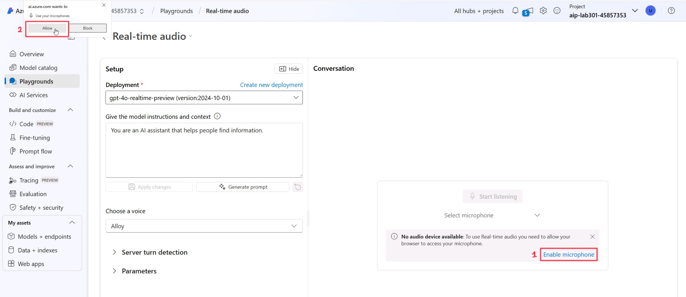

# 第三部分 - 多模态

到目前为止，我们与大型语言模型（LLM）的交互仅限于单一模态：输入文本并接收文本或图像输出。然而，多模态界面正变得越来越流行，因为它允许用户通过多种模态（如文本、图像和语音）与模型互动，从而改善人机交互。在本节中，我们将探索如何使用多模态界面与 **GPT-4o mini** 和 **GPT-4o audio** 进行交互。

> [!TIP]
> **GPT-4o mini** 是一个多模态模型，结合了自然语言处理和视觉理解。它能够处理文本和图像的组合输入，并生成与这两种模态相关的输出。

**GPT-4o realtime** 支持低延迟的“语音输入、语音输出”对话交互。它非常适合涉及用户与模型实时互动的用例，例如客户支持、语音助手和实时翻译。

## 最佳实践

- **上下文具体性**：为当前场景添加上下文可以帮助模型更好地理解适当的输出。这种具体性有助于聚焦于相关方面，避免无关细节。

- **任务导向型提示**：专注于特定任务可以帮助模型在生成输出时考虑该任务的角度。

- **定义输出格式**：明确说明所需的输出格式，例如 markdown、JSON、HTML 等。您还可以建议特定的结构、长度或输出的具体属性。

- **处理拒绝**：当模型表明无法完成某项任务时，优化提示可能是有效的解决方案。更具体的提示可以引导模型更清晰地理解并更好地执行任务。以下是一些提示：
    - 请求对生成的响应进行解释，以提高输出的透明度
    - 如果使用单一图像提示，将图像置于文本之前
    - 要求模型先详细描述图像，然后基于描述完成您的具体任务

- **提示调优**：尝试我们在文本生成场景中探索过的提示调优技术，例如：
    - 分解请求（例如，思维链）
    - 添加示例（例如，小样本学习）

## 使用图像与模型交互

1. 导航到 **playgrounds** 部分并选择 **Try the Chat Playground**

>[!alert] 在开始之前，点击 **Clear Chat** 以避免受之前交互上下文的影响。

2. 在聊天文本框中，点击附件图标上传本地图像。


3. 从桌面上的 ```house-multimodal``` 文件夹中选择所有图像。
4. 上传文件后，尝试以下提示与图像互动：

```
Create a tagline and short description for this rental home advertisement.
- The first picture is from the home
- The other pictures are from sights nearby
- In the description use the features of the house and make the ad more compelling with the sights. 
- Do not talk about features not visible in the images.
- If you have information about the location of the images, use that information in the description
```

## 提供上下文

在接下来的演示中，我们有一张被遮挡的图像。图像中故意添加了边框以遮挡完整的上下文。

1. **清除聊天记录**，并在聊天文本框中添加提示：``what is that?``
2. 点击附件图标，进入桌面文件夹，上传 [context-001](./Images/context-001.png) 图像并发送提示。

> 如果我问“嘿，这是什么？”，您可能会发现难以识别这段文字。这展示了光学字符识别中一个经典的计算机视觉挑战：解读模糊的、孤立的单词。现在，如果我使用 gpt-4o-mini 并问“这是什么？”，它会回答“由于手写风格，文字不清晰。可能是‘Mark’。” 它还指出“部分文字被遮挡，无法读取。”

3. 我们将添加一张新图像，进入桌面文件夹并上传 [context-002](./Images/context-002.png) 图像到聊天中，提示为 ```Extract all the texts from the image. Explain what you think this is.```

> 虽然揭示了更多内容，但仍然很难辨认这是什么。这次提示稍作调整为：“从图像中提取所有文字。解释你认为这是什么。” gpt-4o-mini 回答说：“这写着‘milk, steak’，似乎是一个购物清单。” 它还指出图像仍部分被遮挡，这非常有趣。

4. 我们将添加最后一张图像，进入桌面文件夹并上传 [context-003](./Images/demo-4-context-003.png) 图像到聊天中，提示为：```Extract all the texts from the image. Explain what you think this is.```

> 在揭示完整图像后，我们看到 gpt-4o-mini 是正确的——这确实是一个购物清单。它准确地识别了诸如“mayo”和“organic bread”等项目。更有趣的是，它对底部备注的解读。它捕捉到了细微的上下文，指出“啤酒项目上的备注表明一种提醒或强调适量饮用的建议。”

## 实时语音交互

通过集成 **gpt-4o-realtime-preview** 模型，用户可以通过语音命令与平台互动，使购物体验更加生动和便捷。

1. 返回 **Playgrounds** 并选择 **try Real-time audio playground**，将部署设置为 **gpt-4o-realtime-preview**

2. 在 **model instructions box** 中更新以下内容：

    ```You are a pirate, and every response must be full of pirate lingo. ```

3. 在 playground 中，点击 **enable microphone**，弹出窗口后，点击允许以启用语音交互。



4. 点击 **start listening** 按钮，通过语音说出 ``hello`` 并向模型提问一些事实问题。

5. 接下来，修改系统消息的语气如下，再次与模型互动：

```You are a valiant medieval knight. Every response should echo the chivalry, honor, and grandeur of the court. Speak with formality and grace, as if addressing kings, queens, and noble warriors.```

## 后续步骤

恭喜！您现在已完成实验的第三部分，并学习了如何与多模态模型进行交互。

前往 [第四部分：Azure AI Agents](./05_AI_Agents.md)

**免责声明**：  
本文档使用基于机器的人工智能翻译服务进行翻译。尽管我们努力确保准确性，但请注意，自动翻译可能包含错误或不准确之处。应以原文档的原始语言版本为权威来源。对于关键信息，建议使用专业人工翻译。我们不对因使用本翻译而产生的任何误解或误读承担责任。